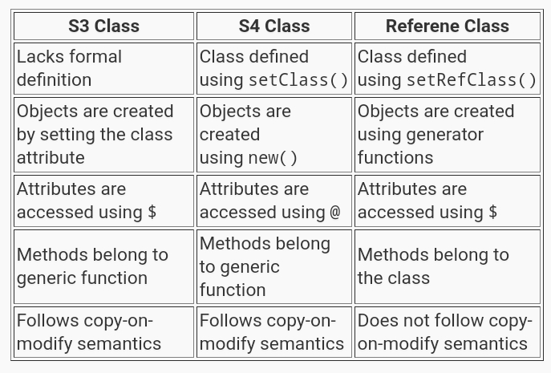
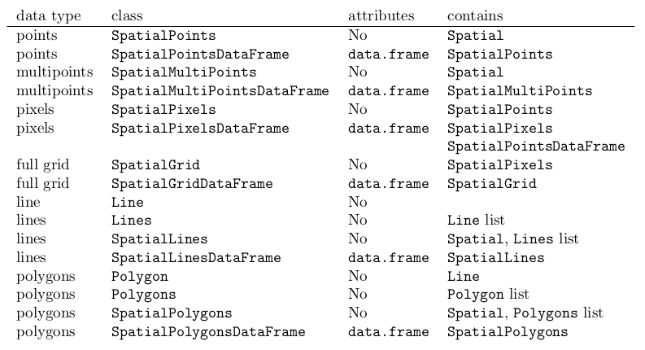
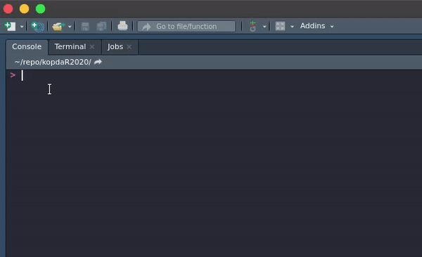
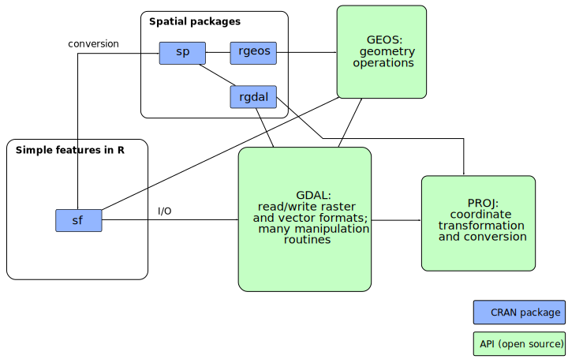
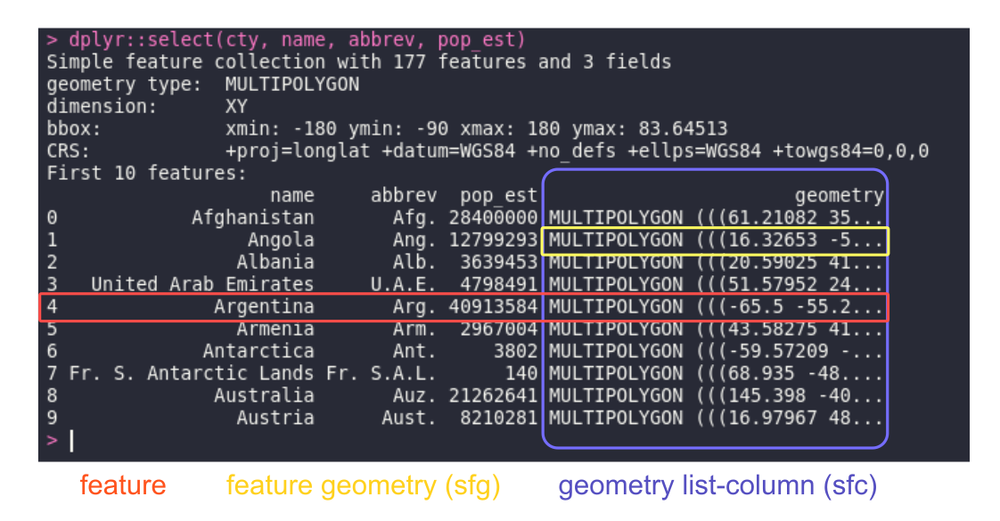

class: inverse, center, middle

# Overview

---

## What shared about

- First section such in a book of spatial analysis

- Preliminary task before explanatory and understanding data

--

### Contents

- Rpatial usage

- Data structures in R

- GIS terminology

- Working with spatial data

  - Vector data: **sp**, **sf** packages (*comprehensive*)
  
  - Raster data: **raster** package (*simple*)
  
  - Working with datacubes: **stars** package (*introduction*)

- Spatial packages for analysis

---

## Rspatial usage

- hydrology, climate, weather modelling or predicting

- species observation and monitoring

- forestry

- environmental analysis

- socio-economic and demographic analysis

- infrastructure development and evaluation

- epidemiology

- data journalism

- etc.

---
## Data structures

<center></center>

.footnote[Image: venus.ifca.unican.es/Rintro]

and...

---

## Data structures

The object is a data structure having some attributes (slots) and methods. Central to any object-oriented system are the concepts of *class* and *method*.  Object system in R: 

- S3 class, most of the R built-in classes

- S4 class, improvement over S3

- RC (references class)


<center></center>

---
class: inverse, middle, center

# GIS Terminology

---
background-image: url(http://michaelminn.net/tutorials/gis-data/2019-points-lines-polygons.png)
background-size: 660px
background-position: 50% 50%

## GIS data

.footnote[source: michaelminn.net]

---
background-image: url(https://raw.githubusercontent.com/akherlan/idjn-rspatial/master/assets/projections.png)
background-size: 660px
background-position: 50% 50%

## Projection

---
class: inverse, middle, center

# Working with Spatial Data

---

## **sp** package

A package providing classes and methods for spatial data: points, lines, polygons and grids.

The **sp**'s class objects:

<center></center>

---

### **sp** class

The **sp** used S4 class object, attributes or slots could be accessed using `@`.

```{r}
cty_sp <- rnaturalearth::ne_countries(returnclass = "sp")
slotNames(cty_sp)
```

<center></center>

---

### Methods for **sp**

Some functions for accessing slot from **sp** class data:

```{r}
library("sp")
proj4string(cty_sp)
bbox(cty_sp)
# don't using data(), it's not sp method
cty_sp@data[c("name", "abbrev", "pop_est")][71:73,]
```

---

## **sp** or **sf** ?

<center></center>

---
background-image: url(https://user-images.githubusercontent.com/520851/34849243-0972e474-f722-11e7-9a3d-2d4bf5075835.png)
background-size: 160px
background-position: 90% 8%


## Why not just use **sp**

Absolutely, **sp** is powerfull!

But **sf** ...

--

- using `data.frame` structure

--

- common attribute table format

--

- GIS GUI app user friendly

--

- and loves **tidyverse**!


<center></center>

---

## **sf** package

The **sf** package in R is an implementation of [Simple Features](https://en.wikipedia.org/wiki/Simple_Features). Referring spatial data classes, method and the package's name. **sf** uses S3 class while **sp** uses S4.

Installation:

```{r eval=FALSE}
install.packages("sf")
```

But...

--

Firsly, install dependencies, especially on MacOSX and Linux ([more](https://r-spatial.github.io/sf/)):

- GEOS, supporting geometrical operations
- GDAL, supporting all driver options
- PROJ, for CRS conversions and transformations

```{r}
library("sf")
```

Windows require Rtools for [rwinbin](https://github.com/rwinlib/) static library. So, install Rtools instead.

---
background-image: url(https://keen-swartz-3146c4.netlify.app/images/sf_deps.png)
background-size: 800px
background-position: 50% 60%

### Dependencies

.footnote[Credit: r-spatial.org (See ... for more details)]

---
background-image: url(http://s2geometry.io/devguide/img/s2hierarchy.gif)
background-size: 680px
background-position: 50% 62%

### The earth is no longer flat

- Upcoming **sf 1.0** will use **s2** for spherical geometry.
- More info: [www.r-spatial.org](https://www.r-spatial.org/r/2020/06/17/s2.html)

.footnote[source: s2geometry.io]

---

### Reading vector data

Reading various spatial data formats handled by GDAL, both vector and raster formats.

```{r}
nc <- st_read(system.file("gpkg/nc.gpkg", package="sf"))
```

---

### Available drivers

```{r}
nrow(st_drivers("vector"))      # counting vector drivers
nrow(st_drivers("raster"))      # counting raster drivers
head(st_drivers()$name, 40)     # driver sample
```


---
background-image: url(https://user-images.githubusercontent.com/520851/50280460-e35c1880-044c-11e9-9ed7-cc46754e49db.jpg)
background-size: 760px
background-position: 50% 60%

### Attribute table alike

---

### Attribute table alike

Geometry information (feature geometry) store in a list-column as one of `data.frame`'s field binding with its attribute table.

```{r}
head(nc)[,4:5]
class(nc)
```

---

### Attribute table alike

```{r eval=FALSE}
cty <- rnaturalearth::ne_countries(returnclass = "sf")
dplyr::select(cty, name, abbrev, pop_est)
```


<center></center>

---

```{r}
methods(class = "sf")       # Most start with prefix st_
```

---

### Map plot

.pull-left[
**base** (actually **sf** method)

```{r map1, fig.height=5, dev='svg'}
plot(st_geometry(nc),
     col = "gray")
# plot(nc[0])
```

]

.pull-right[
**ggplot2**

```{r map2, fig.height=5, dev='svg', eval=require('ggplot2')}
ggplot(data = nc) + 
  geom_sf()            #<<
```

]

---

### **dplyr** style

Filter rows and columns using **dplyr** functions `filter()` and `select()`:

```{r}
suppressPackageStartupMessages(library("dplyr"))
nc %>% 
  filter(AREA > 0.21) %>% 
  select(CNTY_ID, NAME, AREA)
```

---

### Geometry attributes

The `st_drop_geometry()` function can be used to remove the geometry column:

```{r}
st_drop_geometry(nc) %>% head(5) %>% .[,5:7]
# st_set_geometry(nc, NULL)           # will give same result
```

Get the extent of feature geometry using `st_bbox()` function:

```{r}
st_bbox(nc)
```

---

Transform projection to `EPSG:4326` and print the CRS information:

```{r}
st_transform(nc, crs = 4326) %>% st_crs()
```

---

## Handling raster in R

Simple features (sf) don't scale for raster or imagery data. Using **sp** or **raster** instead.

The **raster** package has functions for creating, reading, manipulating, and writing raster data. Uses an S4 slot structure.

- `RasterLayer`: single-layer (variable) raster data

- `RasterStack`: multi-layer data linked to multiple file

- `RasterBrick`: multi-layer data linked to single (multi-layer) file

while...

--

**terra** (the other raster operator) has only one class object for any kind of raster data: `SpatRaster`. No distinctions between single-layer and multi-layer rasters.

---

## RasterStack & RasterBrick

Listing raster data in a directory:

```{r}
suppressPackageStartupMessages(library(raster))
# 10m precipitation data: https://www.worldclim.org/data/worldclim21.html
prec_path <- "~/R/data/prec/wc2.1_10m_prec"
prec_list <- list.files(prec_path, full.names = TRUE, pattern = ".tif$")
prec_list
```

---

### Creating object

Creating a `RasterStack` object from multiple files using `stack()`.

```{r}
prec_stack <- stack(prec_list)
crs(prec_stack)
extent(prec_stack)                     # world
xres(prec_stack); yres(prec_stack)     # 0.167 degrees
```

---

### Time series

It is actually 1970-2000 monthly average data. Assume it occurred along 2020 for time series simulation only.

```{r}
bb_idn <- matrix(data = c(94.77,-11.21,141.02,6.27), 
                 nrow = 2, ncol = 2)

idn <- crop(prec_stack, bb_idn)

t <- as.Date(paste("2020", as.character(1:12), "01", sep = "-"))

idnTS <- rts::rts(idn, t)

class(idnTS)
```

---

```{r out.width='90%', fig.height=5}
plot(idnTS)          # Caution! Dummy data
```

---

### Defining extent

```{r out.width='90%', fig.height=4}
bbb <- matrix(data = c(106.4012,-6.8187,107.1565,-6.2948), 
              nrow = 2, ncol = 2)
bogor <- crop(idn, bbb) ; plot(bogor)
```

---

### Accessing values

```{r}
values(bogor)[,1]             # a number of row of raster object
getValues(bogor$wc2.1_10m_prec_01)                  # all values
min(bogor)                    # multiple min values in one layer
```

---

```{r out.width='90%', fig.height=6}
hist(bogor, xlim = c(0,500))
```

---

class: inverse, middle, center

# Working with Datacubes

---

## Raster and vector datacubes

Multi-dimensional spatiotemporal arrays with `stars`.

<center></center>

---

## Loading data

```{r}
suppressPackageStartupMessages(library("stars"))
landsat7 <- system.file("tif/L7_ETMs.tif", package = "stars")
landsat7 <- read_stars(landsat7)
class(landsat7)
```

---

```{r}
dimnames(landsat7)
landsat7                  # show(landsat7)
```

---

```{r}
plot(landsat7, main = paste("Band", 1:6), col = grey(1:9/10))
```

---
class: inverse, middle, center

# What's Next?

---
class: inverse, middle, center

## It's just a beginning

CRAN Task View: [Analysis of Spatial Data](https://cran.r-project.org/web/views/Spatial.html)

---
class: inverse, middle, center

# And ...

---
class: center, middle

# Join!

<center></center>

**Telegram Group Komunitas R Indonesia**

[**@GNURIndonesia**](https://t.me/GNURIndonesia)

---
class: center, middle

> *"Don't be afraid to ask a question!*
*You* **R** *contributing by asking the question.*
*You may not get the answer instantly,*
*you may not get the answer ever, but*
*at least you're keeping the discussion going."*

Robin Lovelace (pointing Roger Bivand's statement on [a talk](https://youtu.be/_HBpzbbUVgc?t=3240))

---
class: inverse, center, middle

# Thanks!

Twitter: [**@terusterang__**](https://twitter.com/terusterang__)

Github: [**akherlan**](https://github.com/akherlan)
